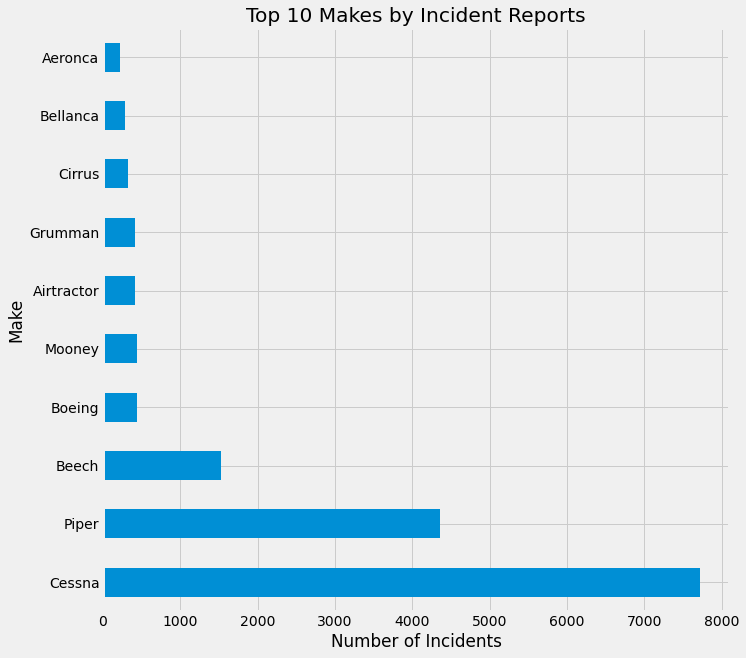
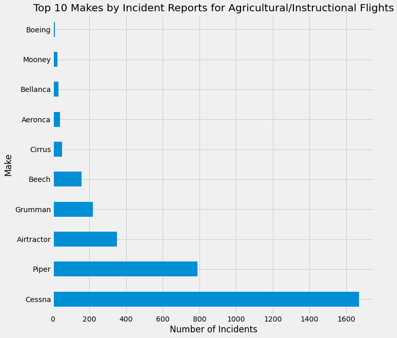

# Aviation Safety

## Business Understanding

## Data Understanding

Our data come from the Kaggle [Aviation Accident Database & Synopses](https://www.kaggle.com/datasets/khsamaha/aviation-accident-database-synopses/), which is itself pulled from the National Transportation Safety Board (NTSB). The data, with a handful of exceptions, begin in 1982 and go up to 2022. We start with 88,889 entries, with 31 different columns of data:

Before diving too far into the data, it is important to emphasize what we do *not* have. **The most important limitation is that we don't have information on flights for which there is no incident report** -- which is filed when something goes wrong with the plane. We don't have the denominator of total flights during this period. Instead, we only have flights for which an incident report was filed.  

## Data Preparation

We did our data cleaning in `notebooks/data_cleaning.ipynb`, after which we exported a cleaned version of the data to `data/AviationData_cleaned.csv`. Here, we'll recap exactly what we did to clean the data.

## Data Analysis & Visualization

#### Purpose of Flight

The first way we'll slice up our data is using the `Purpose.Binned` category that we created in our `data_cleaning.ipynb`, since we (1) want to figure out if there are safer and less safe purposes to which planes are used and then (2) if there are certain types of airplane that are safer for that specific type of activity. 

What can we see above? Most importantly, the vast majority of incident reports stem from "personal" flights. Unfortunately, as mentioned in the Data Understanding section above, we don't have the total number of flights -- i.e., including those for which no incident was reported -- so we will need to explore other ways of judging the safety of the different purposes above.

### Personal Injury & Purpose of Flight

The first way we'll try to judge the safety of these different purposes of flight is using the number of people injured in a given incident. These data are found in `Total.Fatal.Injuries`, `Total.Serious.Injuries`, and `Total.Minor.Injuries`. We'll also initially include `Total.Uninjured` to see if that might be a helpful metric:

It turns out we probably didn't want to include the uninjured count, so we'll redo the chart without that column. We'll also use a stacked bar chart, so we can more easily compare the total number of injuries by purpose of flight:

We can now see that **aerial application** (which corresponds to, and which we will usually refer to as **agriculture**) and **flight test** are the purposes which produce the fewest average injuries per incident. On the flip side, entries for **recreational** flights typically report many more injuries than *any* of the other categories (and especially agriculture and instruction).

### Damage to Plane & Purpose of Flight

We also want to take a look at the extent of damage that is typically reported in incidents, grouped again by the different purposes. (Again, it's worth emphasizing that this doesn't tell us *which planes are more likely to sustain certain damage*, but rather *given that there is an incident report for a certain type of flight, what type of damage we will typically expect.*)

[Type of Aircraft Damage by Purpose of Flight](images/craft_damage_by_purpose.png)

There are so many more incidents of damage reported for personal flights that it makes it difficult to understand the rest of the graph. (Again, we can't draw huge conclusions from this, since there may be many more total personal flights than other types of flights.)

We might get slightly more useful information if we look at the percentages of the different types of damage reported:

What do we learn here? First, air shows incidents (unsurpisingly) tend to result in destruction of the airplane more often than incidents for other flight purposes. Additionally, we can see that instructional flights will involve a destroyed plane less often. Again, that makes sense since you have a very competent pilot overseeing the operations of the plane.

### Makes of Planes

We now want to check out whether certain makes of planes are safer than others. We also want to see if certain makes of planes are safer for certain uses -- in our case, given that we are emphasizing safety, for the purposes of agriculture (aerial application) and instruction.

We already did a significant amount of cleaning of the `Make` column in our `data_cleaning.ipynb`, so let's check it out: 

We still have 968 different types of plane listed. We also have a large number of planes that only have one or two entries total (you can run a `df['Make'].value_counts().tail(25)` to take a look.) Since we're looking at getting into the aviation business, we'll want to direct our attention to the more common makes, since (1) people will be more familiar with those makes, (2) they'll be more ubiquitous and therefore more likely to be easily serviced and maintaned, and (3) they'll have a longer safety track record. 

The full analysis in `final.ipynb` then filters our DataFrame in two different ways: by the top 25 most common makes, and the top 10 most common makes. The top 10 version is more illustrative, so that's what we reproduce here; if you want to see both versions, they are available in the file. Here's the top 10 list:

And the graph:

### Personal Injury & Airplane Make

With our newly subsetted DataFrame, we can try to judge the relative safety of the different makes of plane. We'll start off again by looking at the average number of injuries for each incident, once again broken down into fatal, serious, and minor. (In this case, we are preemptively excluding the non-injury category.) 

The main takeaway here seems to be that incidents involving a Boeingv are much more likely to result in serious injury. That is unsurprising, since there are so many more people on each plane. But, since we're interested in agriculture and instruction, we're not as concerned with these big passenger planes. In a second, we'll repeat this analysis with incidents where the purpose of the flight was agricultural or instructional.

We'll first take a quick look at the total numbers of types of aircraft damage by make -- again, not expecting much since we don't have the total number of flights. 

And, as we would expect, we see a lot of incidents involving Cessnas and Pipers. We can, then, try to look at percentages rather than total numbers:

# Subsetting the data: agriculture and instructional

We can now take a look at the data for our chosen categories of **agricultural** and **instructional.** As a reminder, we chose these categories because they appeared to be the safest option (in terms of injury and damage). While commercial passenger flights might be comparably safe, competing with established airlines would require a likely insurmountably high initial investment, with no guarantee of success. Thus, we choose to focus instead on agriculture and instruction.

After subsetting our data by purpose, we can re-run our subsetting by make to get our new list of the 10 most common makes for this DataFrame:

As we might expect, Boeing has dramatically decreased, while Cessna and Piper remain the top two results. More significantly, we can see **AirTractor has moved much higher up on the list**. This again makes a lot of sense -- AirTractor makes planes specifically for agriculture and aerial application. Let's now check out some of the same safety metrics we used above, but with our new set of makes.

And the percentage of the different types of aircraft damage:

We can again see the relative safety of AirTractor- and Cessna-made planes. While Boeing and Aeronca have slightly fewer average injuries per incident, the difference is small, and the advantages of AirTractor and Cessna for our purposes remain: AirTractor is specifically designed for the agricultural sector, and Cessna is far and away the most ubiquitous make of aircraft.

### Weather

Lastly, we can take a look at the impact of weather. **VMC** refers to "visual meteorological conditions," i.e. instances of good weather, where you can see what is going on. **IMC** refers to "instrumental weather conditions," when instruments are necessary to navigate through the bad weather. 

We'll first take a look at the effect of weather for our larger dataframe, and then the one subsetted for agriculture and instruction:

Weather has the effect that we expect -- bad weather conditions make it more likely that an incident will involve a destroyed plane. This is true regardless of our subset. From this, we can offer a third suggestion: be picky about the conditions under which planes can be flown. Not only will the presence of an **instructor or extra-competent pilot** improve safety outcomes, mandating that planes can only be flown under **good weather conditions** will also prove helpful.